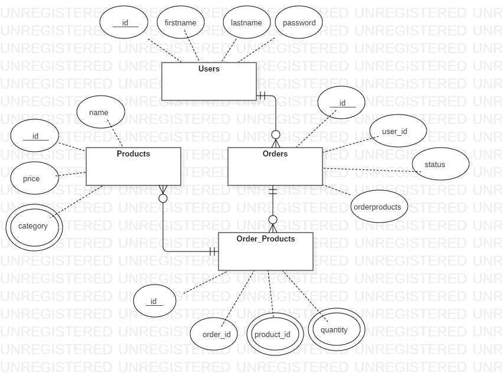

# Product EndPoints

## index all products
Get http://localhost:3000/products/

## show product
Get http://localhost:3000/products/:id

## create product
Post http://localhost:3000/products/
### Authorization
Bearer token token: jwt
### request body example (JSON)
{
    "name": "milk",
    "price": "12",
    "category": ["food"]
}

## update product
Put http://localhost:3000/products/:id
### Authorization
Bearer token token: jwt
### request body example (JSON)
{
"id": 1,
"name": "milk",
"price": 14,
"category": ["groccery"]
}

## delete product
Delete http://localhost:3000/products/:id
### Authorization
Bearer token token: jwt

# User EndPoints

## index users
Get http://localhost:3000/users/

## show user
Get http://localhost:3000/users/:id
### Authorization
Bearer token token: jwt

## create user
Post http://localhost:3000/users/
### request body example (JSON)
{
    "firstName": "ahmed",
    "lastName": "mahmoud",
    "password": "dsfgsdfgasdg"
}
>returns the JWT token as a text response

## update user
Put http://localhost:3000/users/:id
### Authorization
Bearer token token: jwt
### request body example (JSON)
{
    "firstName": "ahmedQWE",
    "lastName": "mahmoud",
    "password": "!1234#fasdf"
}

## delete user
delete http://localhost:3000/users/:id
### Authorization
Bearer token token: jwt

## show users orders
Get http://localhost:3000/users/:id/orders
### Authorization
Bearer token token: jwt

# Order EndPoints

## index Orders
Get http://localhost:3000/orders/

## show Order
Get http://localhost:3000/orders/:id
### Authorization
Bearer token token: jwt

## create Order
Post http://localhost:3000/orders/
### Authorization
Bearer token token: jwt
### request body example (JSON)
{
    "user_id": 1,
    "status": 0,
    "productsIds": [2,1 , 2],
    "quantities": [2 , 1]
}

## update Order status
Put http://localhost:3000/orders/:id
### Authorization
Bearer token token: jwt
### request body example (JSON)
{
    "status":1
}

## delete Order
delete http://localhost:3000/orders/:id
### Authorization
Bearer token token: jwt

________________________________________________
# database Schema
## ERD

## Products table
      id          | name           | price          | category
:-------------    | :------------- | :------------- | :-------------
SERIAL PRIMARY KEY| VARCHAR(100)   | FLOAT          | TEXT[]

## Users table
      id          | firstName      | lastName       | password
:-------------    | :------------- | :------------- | :-------------
SERIAL PRIMARY KEY| VARCHAR(100)   | VARCHAR(100)   | VARCHAR(100)

## Orders table
      id          | user_id        | status         | OrderProducts
:-------------    | :------------- | :------------- | :-------------
SERIAL PRIMARY KEY| INTEGER        | BOOLEAN        | INTEGER

## Order_Products table
      id          | order_id       | product_id     | quantity
:-------------    | :------------- | :------------- | :-------------
SERIAL PRIMARY KEY| INTEGER        | INTEGER[]      | INTEGER[]
